

# SecureX Orchestration Workflow to Retrieve and Parse Meraki MX Security Events [v2.0 - LEGACY]

**NOTE:** This workflow has been quality assessed and updated on [the official SecureX Orchestration repository](https://ciscosecurity.github.io/sxo-05-security-workflows/workflows/umbrella/0061-security-events-to-incidents). You may import it directly from the [`CiscoSecurity_Workflows` GitHub](https://ciscosecurity.github.io/sxo-05-security-workflows/importing).

This sample workflow will retrieve all security events from Meraki for a specific Org ID. It will then filter out Malware Downloaded and IDS Priority 1 events. It then sends deatils for this to a Webex  Teams space and create SecureX sightings and incidents. Please make sure to set the 4 variables ('api key meraki', 'api key webex', 'webex space ID' and 'Meraki Org ID') before running (follow the installation steps to do so). You can also run this scheduled by enabling a trigger.

## Features
* Retrieve Meraki MX security events of last hour.
* Filter out high priority events, right now: "Malware Downloaded" and "IDS Priority 1" events.
* Send Webex Teams notification to Space of choice with url to investigate observables in SecureX Threat Response.
* Add sighting and incident (and relate the two) in SecureX with observables of event [NEW IN v2.0], easily start investigation in SecureX Threat Response from there.
* Possibility to run scheduled every hour (trigger is disabled for testing). 
* **UPDATE:** it is now possible to use a webhook for the [**Malware is downloaded**](https://developer.cisco.com/meraki/webhooks/#!webhook-sample-alerts/malware-download-detected) Meraki Alert. I am investigating how to use this to trigger the workflow.

Below you can view the current workflow. Please feel inspired to add to it as you see fit. **Please always test thoroughly before using in production!**

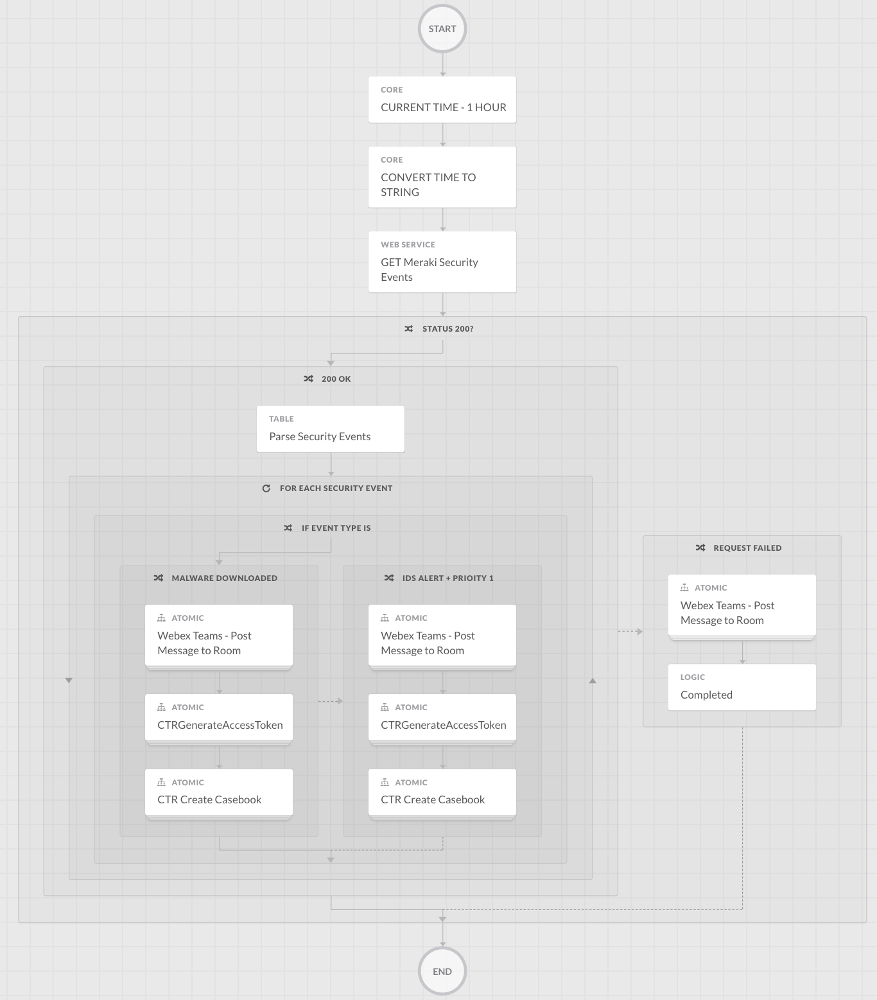

Below you can see the result of the case in SecureX Casebook. Remember, it can also send a Webex Teams message!

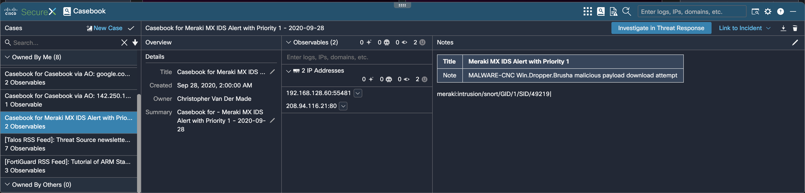

Below you can see the result in Webex Teams, please note the URL, which allows the analyst to easily pivot into an investigation in SecureX Threat Response.:

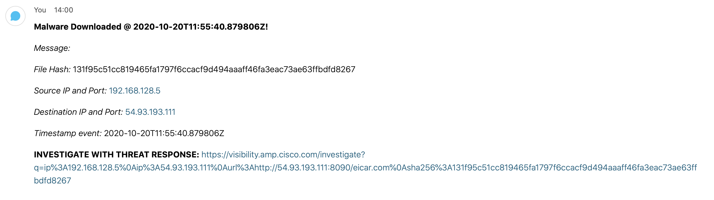

Below is a screenshot of the investigation in SecureX Threat Response when click on the URL in the Webex Teams notifaction:

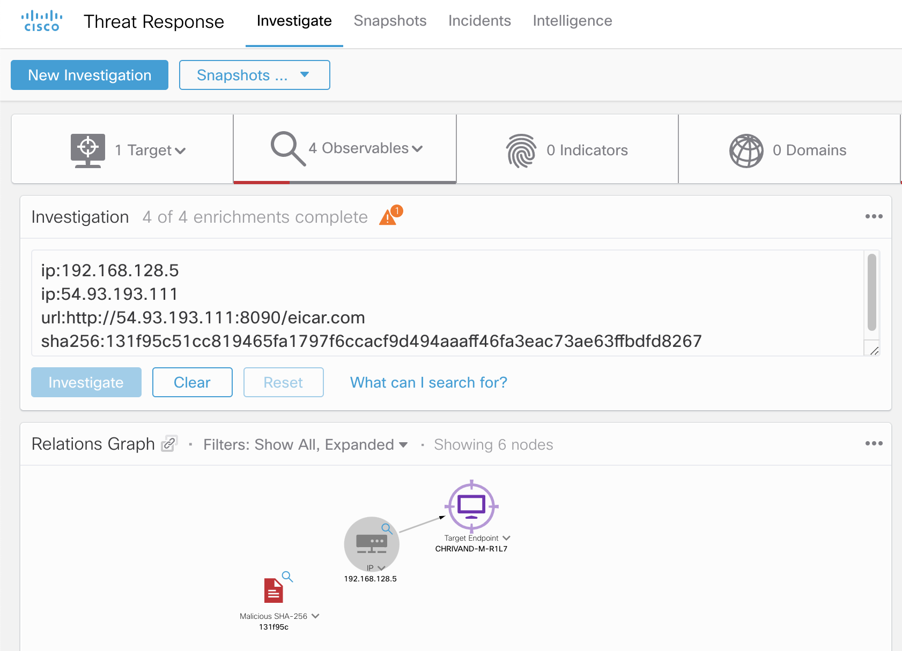

## Installation
1. Browse to your SecureX orchestration instance. This wille be a different URL depending on the region your account is in: 

* US: https://securex-ao.us.security.cisco.com/orch-ui/workflows/
* EU: https://securex-ao.eu.security.cisco.com/orch-ui/workflows/
* APJC: https://securex-ao.apjc.security.cisco.com/orch-ui/workflows/

2. Click on **IMPORT** to import the workflow:

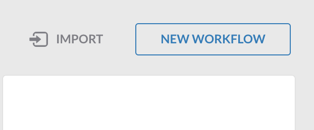

3. Click on **Browse** and copy paste the content of the [meraki-mx-security-events.json](https://raw.githubusercontent.com/chrivand/meraki-mx-security-events-workflow/master/meraki-mx-security-events.json) file inside of the text window. 

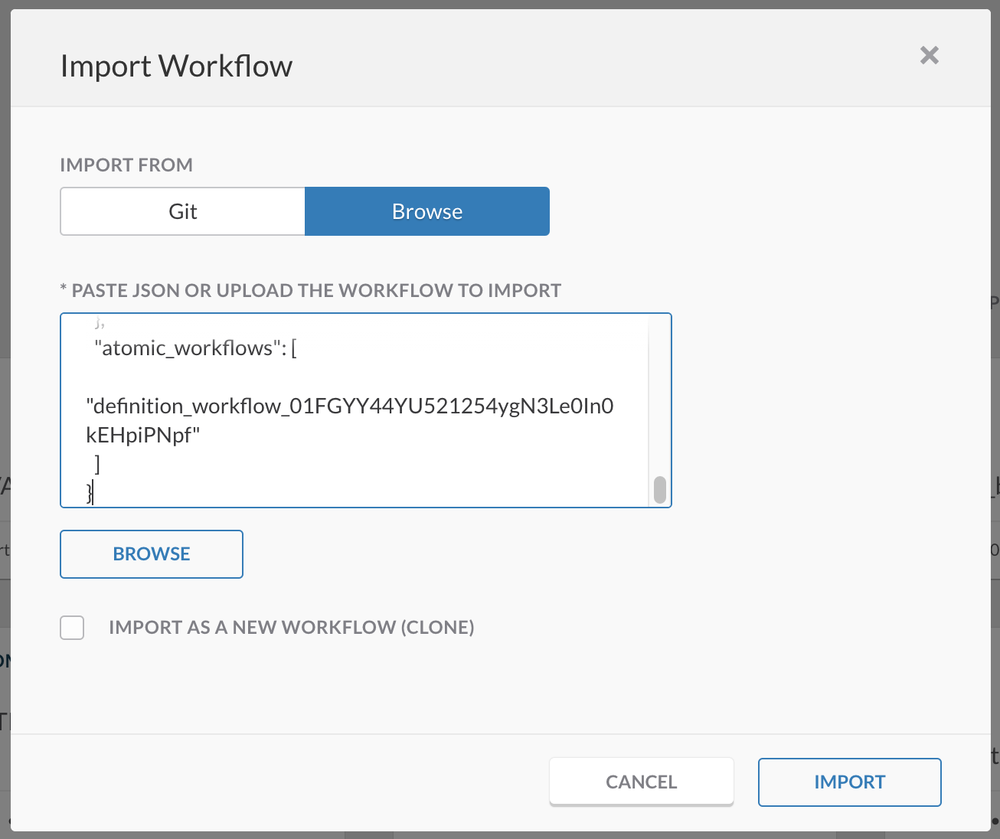

4. Click on **IMPORT**. You will now receive an error that information is missing: 

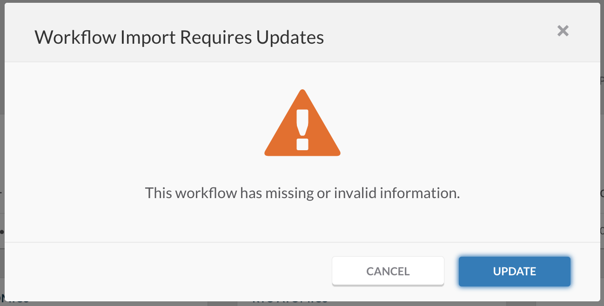

5. Click on **UPDATE** and fill in the CTR (SecureX threat response), Meraki and Webex API key. These are not stored as plain text, as they are stored as "secure strings" in SecureX.

> **Note:** To obtain the threat response API keys, create one here: https://securex.us.security.cisco.com/settings/apiClients. Please change the _.us._ in the url to _.eu._ or _.apjc._ respectively for the European or Asian instances. It might be that you have these already created, just make sure it has at least the `Casebook` scope checked. If you are using the EU or APJC instance, you will also need to change the target of the `CTRGenerateAccessToken` and `CTR Create Casebook` activities in the workflow. You do this by clicking on the activity and scrolling to the `target` section. **Make sure to do this for all 4 related CTR targets!** Here is an example:

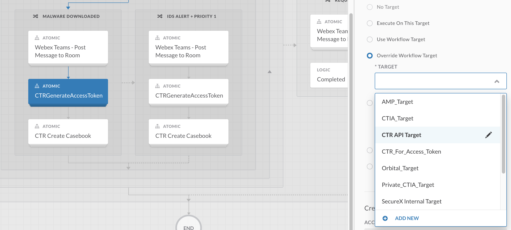

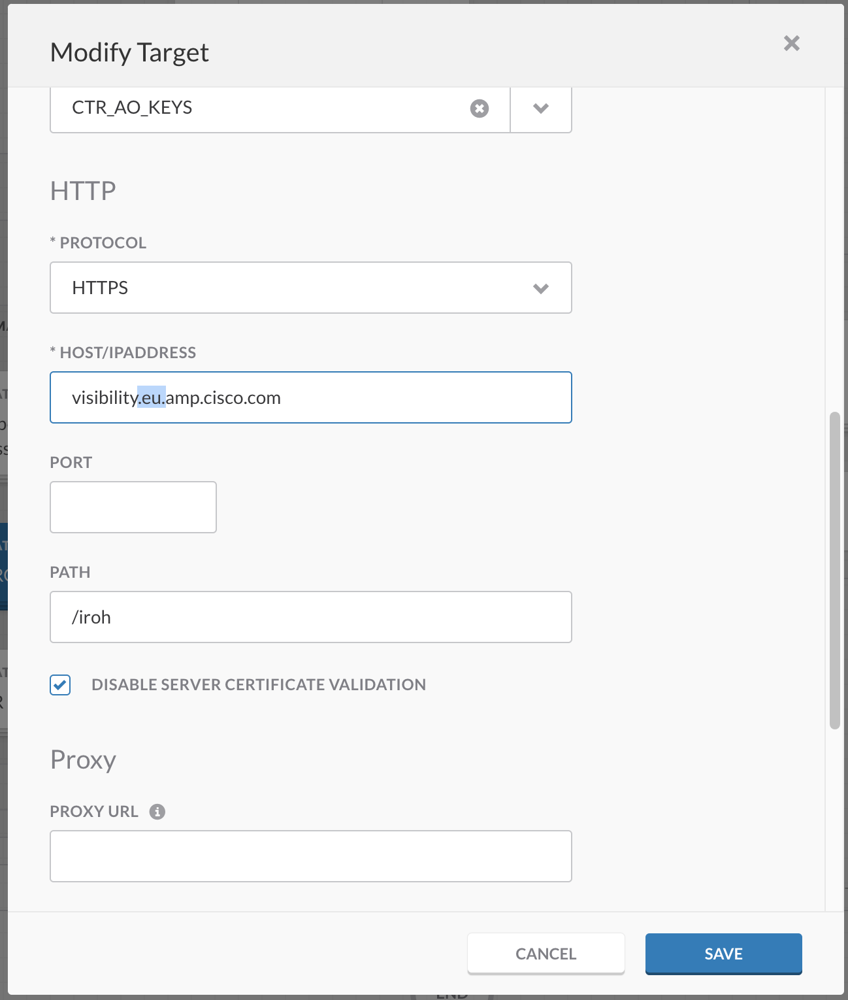

> **Note:** To obtain your Meraki API key, please follow these steps: https://documentation.meraki.com/zGeneral_Administration/Other_Topics/The_Cisco_Meraki_Dashboard_API

> **Note:** Please retrieve your Webex key from: [https://developer.webex.com/docs/api/getting-started](https://developer.webex.com/docs/api/getting-started). Please be aware that the personal token from the getting started page only works for 12 hours. Please follow these steps to request a "bot" token: https://developer.webex.com/docs/integrations.

6. You are still missing 2 more values before you are done. Click on the workflow like below, and let's fill in the Meraki Org ID and Webex Team space ID.

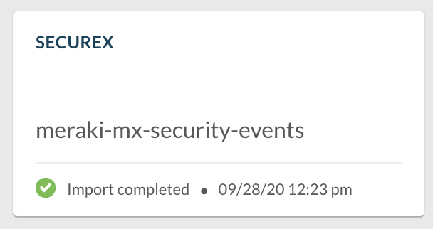

7. Click on the `Meraki Org ID` variable and fill in the Org ID of the Meraki organization that you want to track security events for. More info on this can be found here: https://documentation.meraki.com/zGeneral_Administration/Other_Topics/The_Cisco_Meraki_Dashboard_API#Organizations

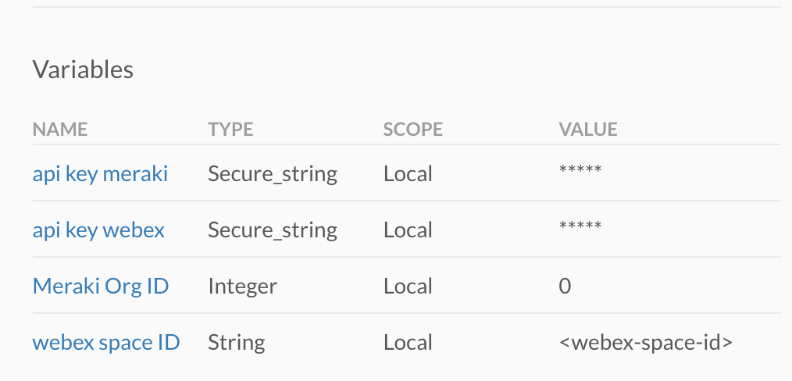

8. Next click on `webex space ID`. You can create a new space or find an existing one via these link: retrieve the Room ID from: https://developer.webex.com/docs/api/v1/rooms/list-rooms. You can also add the roomid@webex.bot bot to the room and it will send you the roomId in a private message and then remove itself from the room.

9. Now it is time to test, click on **RUN** in the top right of your window, and eveyrhting shopuld be working now. If not try troubleshooting by click on the activity that is colored red. 

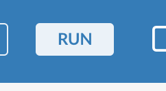

10. As a final step you could choose to enable to scheduled trigger for this workflow. This is recommended, as the workflow only retrieves the security events of the last hour. By scheduling it, the Security analysts will be updated every hour for potential new malicious activity. To enable the trigger, click on the hyperlink below and uncheck the `DISABLE TRIGGER` checkbox. This can be found in the workflow properties in the right menu pane. 

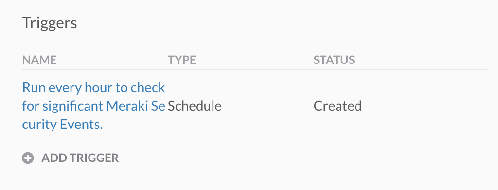

> **Note:** make sure not to select an activity when looking for the global workflow properties.

## Notes

* Please test this properly before implementing in a production environment. This is a sample workflow!
* The roadmap will include a webhook based trigger, instead of a scheduled run. 

## Author(s)

* Christopher van der Made (Cisco)
